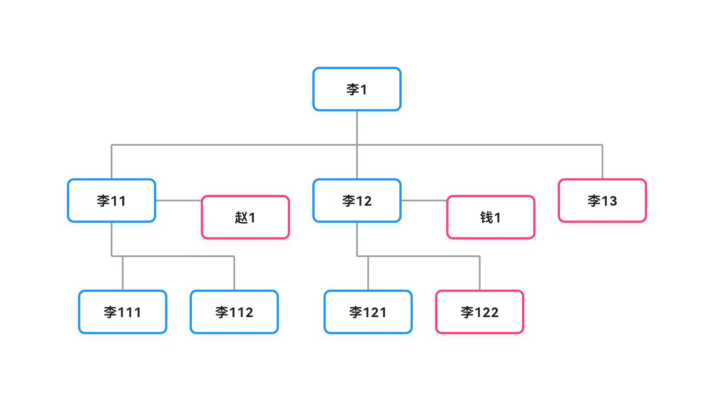

# 家族树 - Flutter 族谱管理应用

一个基于 **Flutter** 开发的轻量级、交互式家族树管理应用。该应用支持动态布局、节点编辑、关系管理以及族谱导出为图片等功能，旨在帮助用户轻松记录和展示家族脉络。

## 🌟 核心特性

- **动态自动布局**：根据节点关系（配偶、子女、排行）自动计算坐标，确保族谱结构清晰、美观。
- **全方位交互**：
  - **缩放与平移**：支持双指缩放和自由拖拽查看大型族谱。
  - **节点编辑**：实时修改成员姓名、性别、排行及位置换位。
- **关系管理**：支持添加配偶、子女、兄弟姐妹，甚至可以向上添加“父亲”节点来扩展祖先。
- **导出分享**：一键将当前族谱渲染并导出为高分辨率 PNG 图片，保存至系统相册。
- **多族谱管理**：支持创建、重命名和删除多个不同的族谱。

## 📸 界面预览
### 图标

### 示例


## 🛠️ 技术栈

- **Flutter / Dart**：跨平台 UI 框架。
- **CustomPainter**：用于高性能的族谱连线渲染。
- **InteractiveViewer**：实现平滑的缩放与平移交互。
- **Gal**：处理图片导出至系统相册。
- **Path Provider**：管理临时文件存储。
- **Vector Math**：辅助视图变换计算。

## 📸 界面预览

- **列表页**：管理您的所有族谱。
- **详情页**：可视化展示家族结构，点击节点弹出操作菜单。

## 🚀 快速开始

### 环境要求
- Flutter SDK (建议 3.0.0+)
- Dart SDK (建议 3.0.0+)

### 安装步骤
1. 克隆仓库：
   ```bash
   git clone https://github.com/your-username/family-tree-flutter.git
   ```
2. 安装依赖：
   ```bash
   flutter pub get
   ```
3. 运行应用：
   ```bash
   flutter run
   ```

## 📂 项目结构说明

- `Node`: 核心数据模型，存储成员基本信息及布局坐标。
- `TreeData`: 族谱容器，管理节点映射表。
- `LayoutEngine`: 布局算法核心，递归计算每个节点的 `blockWidth` 和最终坐标。
- `FamilyTreePainter`: 负责绘制成员之间的连接线（折线风格）。
- `FamilyTreeScreen`: 主交互界面，结合 `InteractiveViewer` 和 `Stack` 实现动态渲染。

## 📝 布局算法逻辑简述

1. **深度优先排序**：根据出生排行对所有子女进行排序。
2. **块宽度计算**：递归计算每个节点及其子孙所占用的总宽度（Block Width）。
3. **坐标分配**：基于块宽度，从根节点开始自顶向下分配 X 和 Y 坐标，并为配偶预留偏移空间。

## 📄 许可证

本项目采用 [MIT License](LICENSE) 开源。

---
